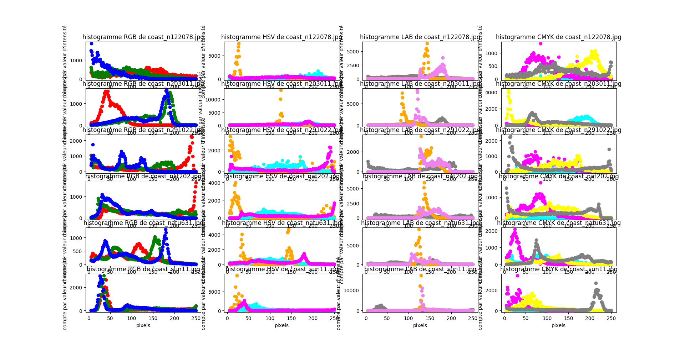

# Coasts

- Majorité du magenta en bas de 100??

# Forests

- Fonctions Gaussiennes dans le RGB
    - Uitliser le Khi-deux pour savoir si c'est gaussien ou pas?
- Corrélation entre le nb de comptes de G et le R (RGB)
- Moyenne du pic violet décalé d'une constante du pic A (orange de LAB)
    - Génrallement à 125 pour le oragne
    - 150 pour le B (violet dans LAB)
- Le K peut probablement être représenter par une gaussienne
    - Semblent tt avoir un grand écrat type (écrasé)
- Pic de V (orange dans HSV) à 50
# Streets

- Corrélation entre le B et le G?
- Pas gaussien pour le RGB, plus en V inversé
- Moyenne du pic violet est à la même place que le pic orange (LABS)
    - Généralement à 125
#### Versus Coasts
- Saturation très basse (cyan dans HSV)
- Magenta très bas